# process-monitor

华中科技大学操作系统课设，基于Qt5的进程资源管理器，参考linux htop和windows任务管理器。

## Dependency

- Qt 5.14.1
- qmake 3.1
- Qt Charts 5.14.1

## Demo

- Main

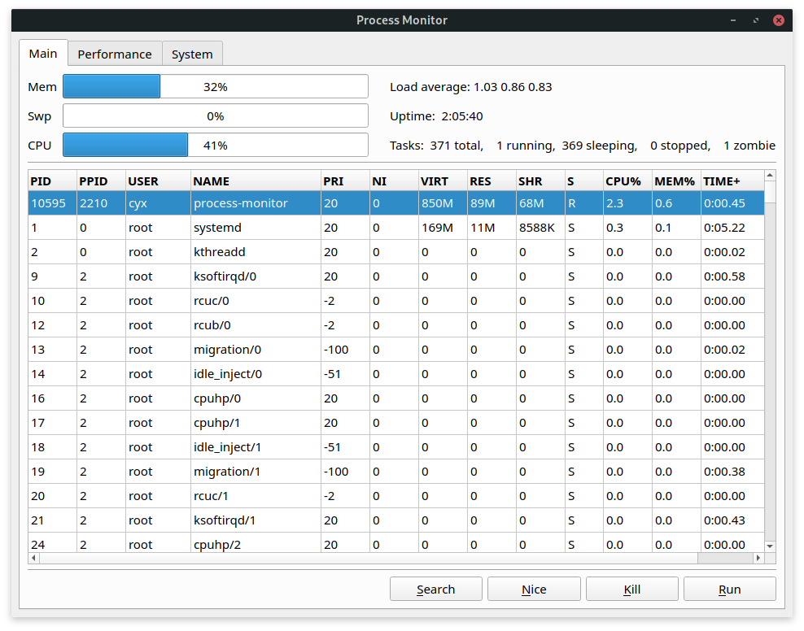

- Search pid

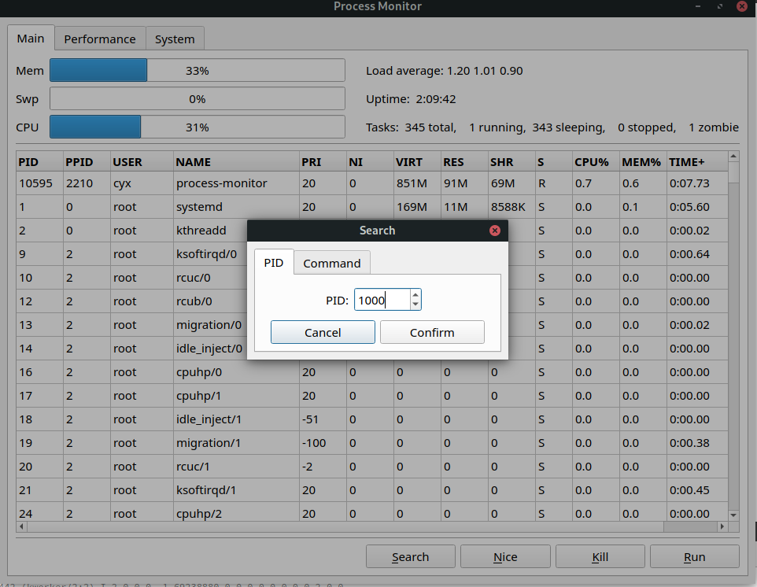
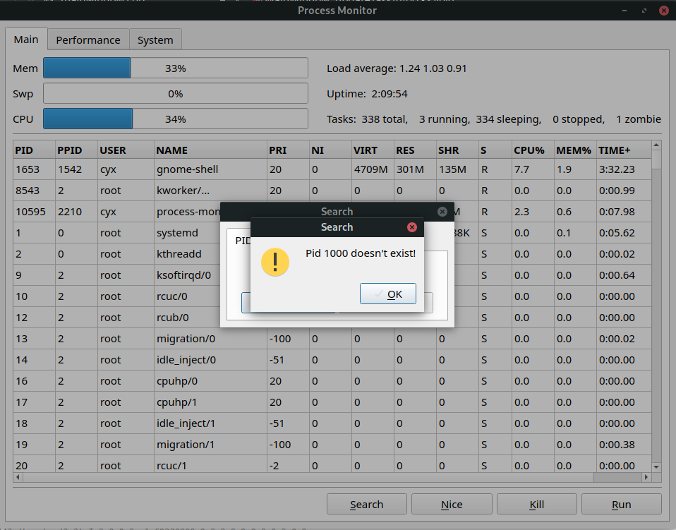
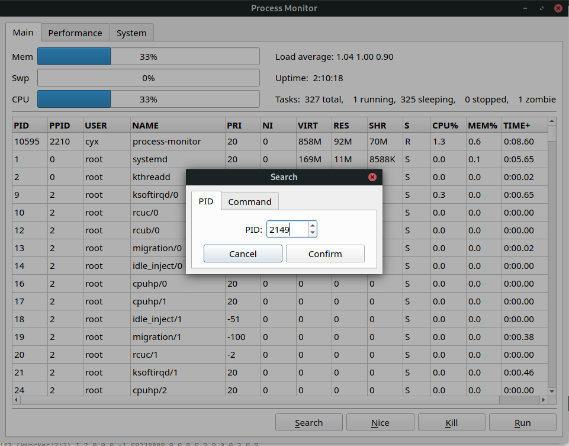
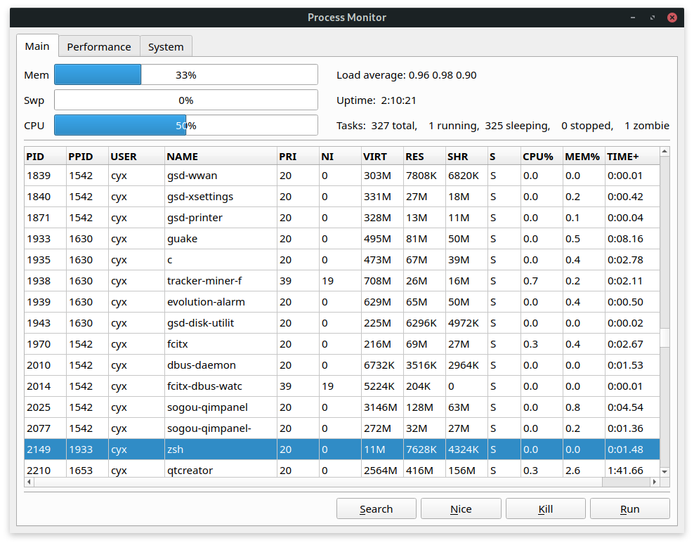

- Search command

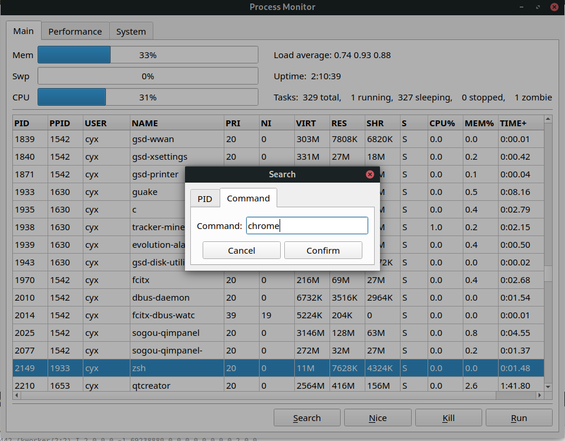
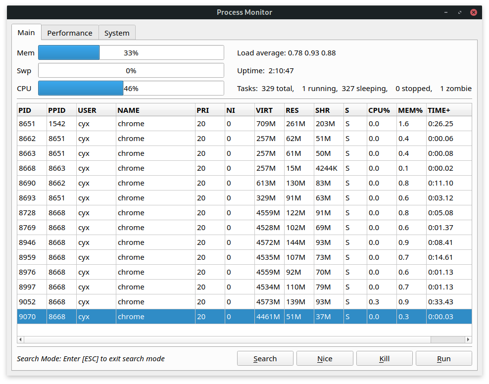

- Run & Kill

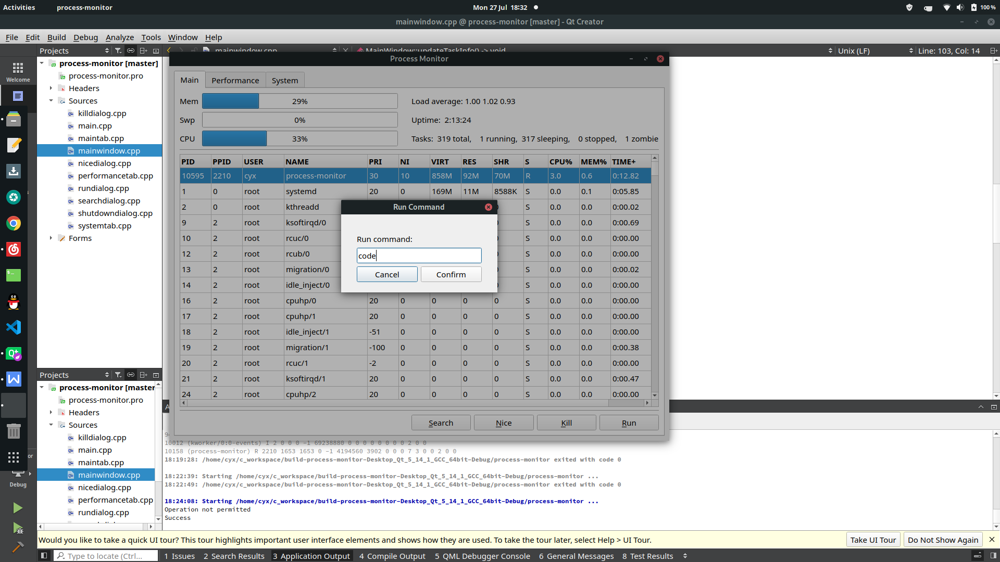
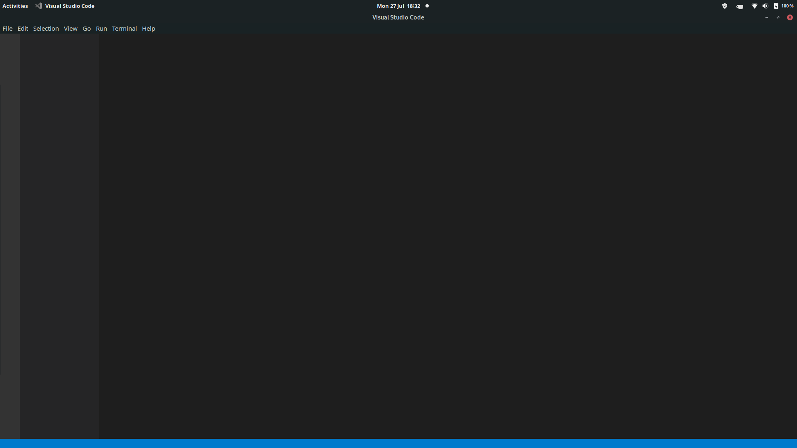
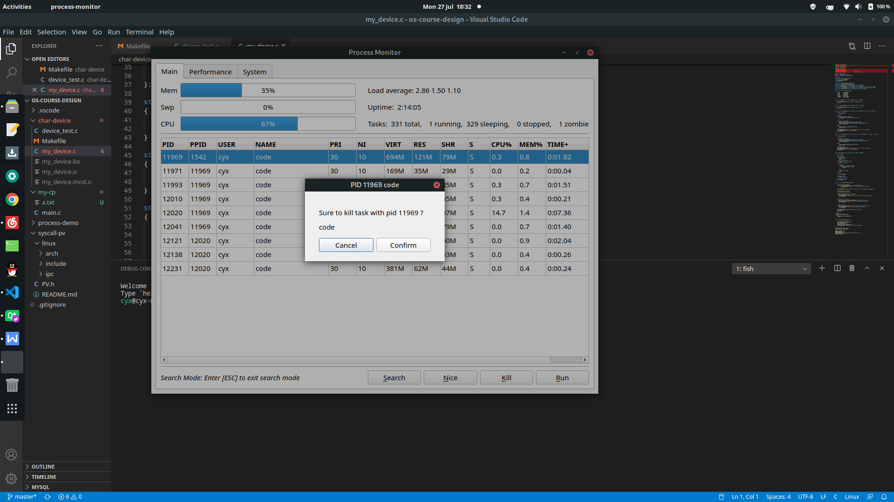
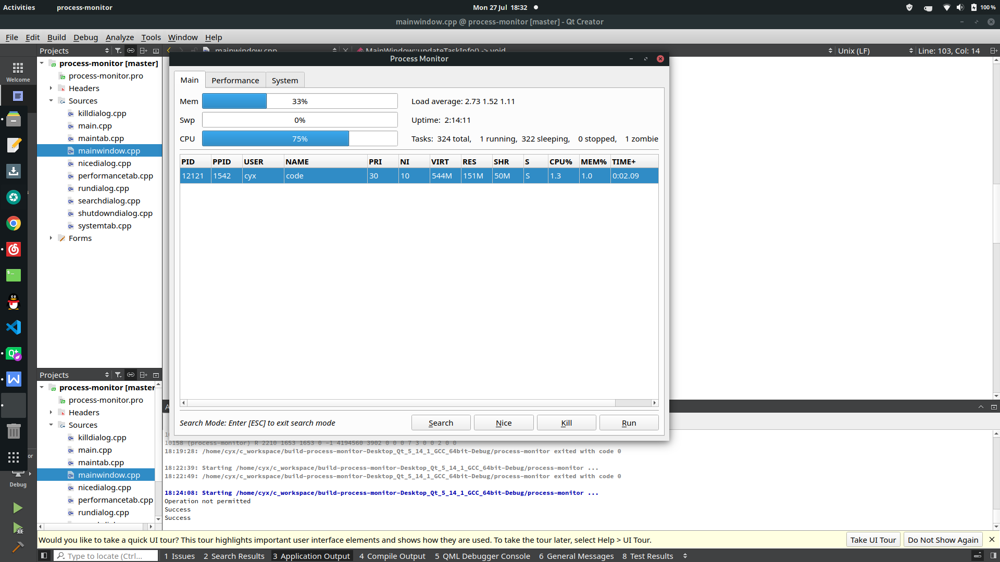

- Performance

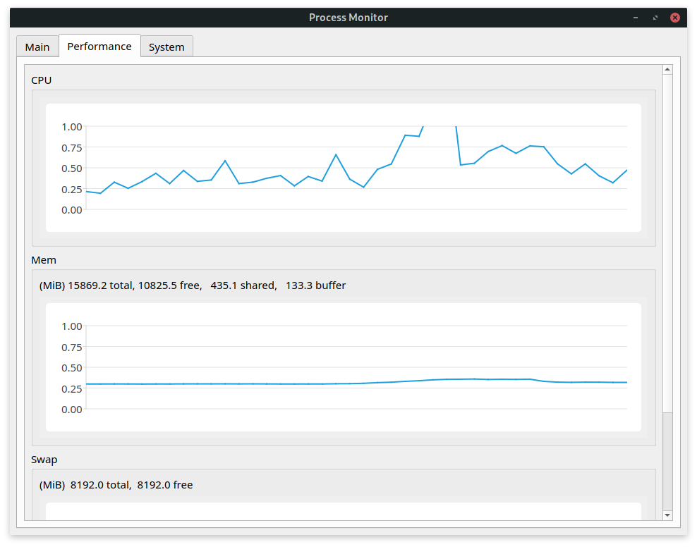
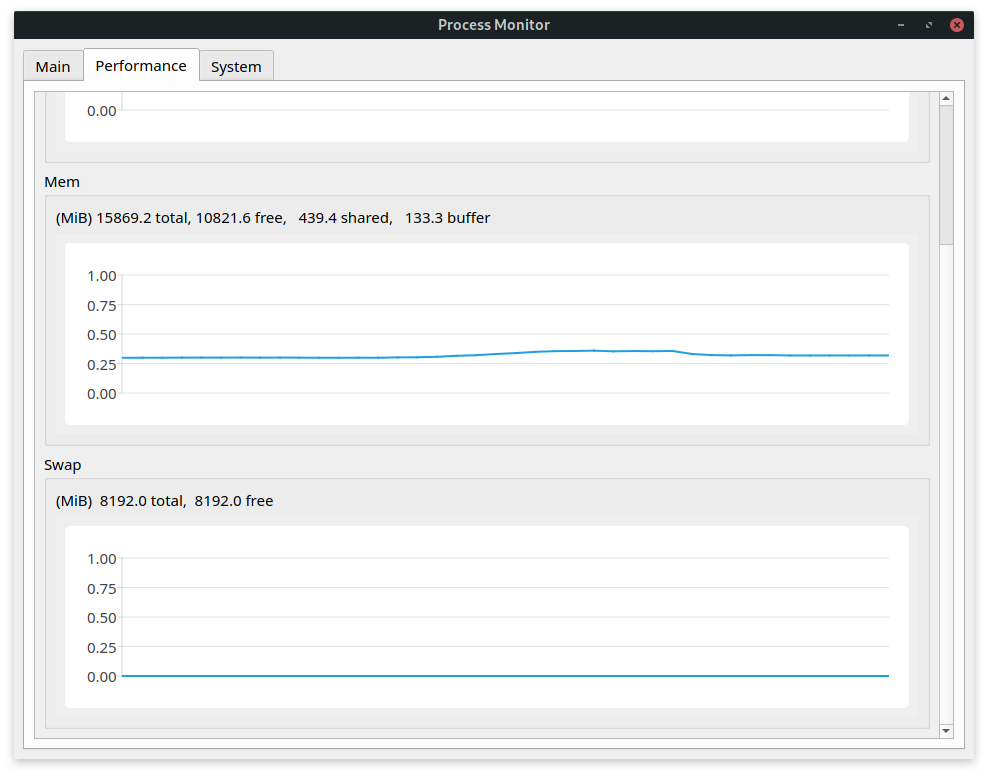

- System Info

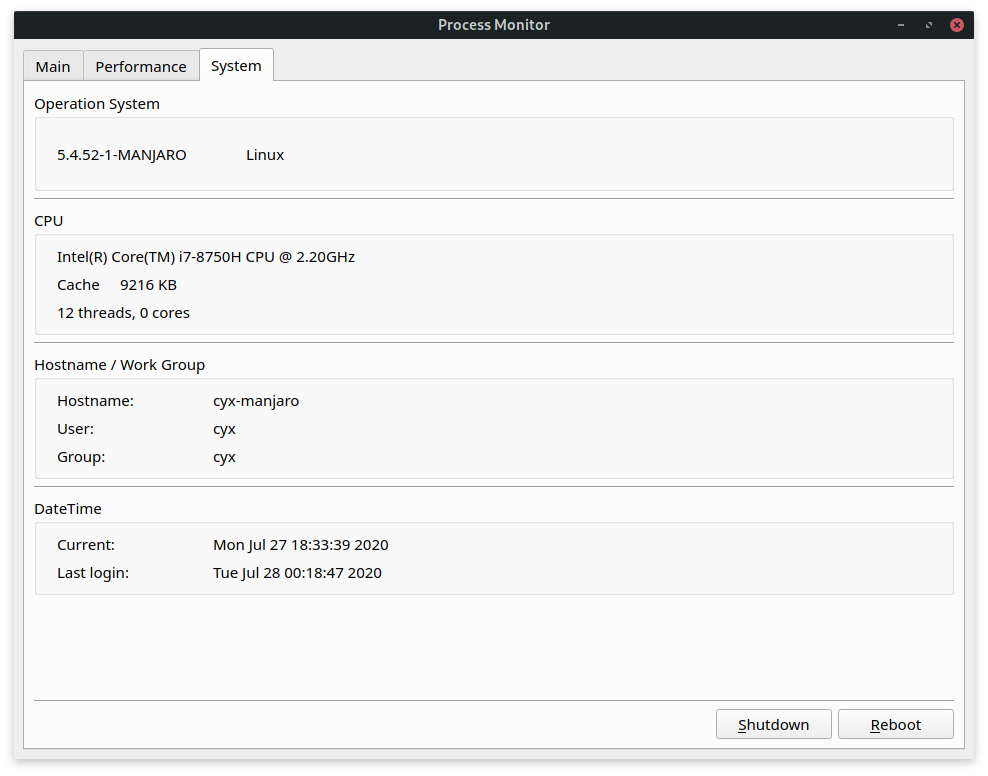
